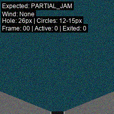
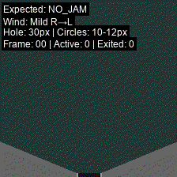
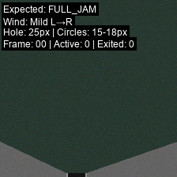

# ELVIS-C

A physics simulation environment for generating video datasets with causal dynamics, focusing on object flow and jam scenarios.

---

## ELVIS Environment (`elvis_env/`)

The `elvis_env` folder contains a physics simulation environment designed for generating video datasets with realistic dynamics and causal relationships. This environment provides tools for creating synthetic video data for machine learning research, particularly for studying causal inference in visual scenarios.

### Available Scripts

The environment currently includes the following simulation scripts:

#### 1. Falling Circles Simulation (`falling_circles.py`)

Generates videos of circles falling through a funnel with configurable physics parameters and jam scenarios.



**Features:**
- **Physics Simulation**: Realistic gravity, wind effects, and collision dynamics
- **Jam Scenarios**: Three configurable jam types for causal modeling
  - `no_jam`: small circles - good flow
  - `partial_jam`: mixed circle sizes - moderate flow issues  
  - `full_jam`: large circles - guaranteed jams
- **Parametric Control**: Adjustable hole sizes, circle sizes, wind strength, gravity
- **Data Export**: Frame-level CSV data for causal analysis
- **Visualization**: Clean PNG frames + labeled GIFs for debugging

**Demo Examples:**

| Scenario | Demo | Description |
|----------|------|-------------|
| No Jam |  | small circles - smooth flow |
| Partial Jam |  | mixed sizes - some blocking |
| Full Jam |  | large circles - frequent jams |

#### Future Scripts

Additional simulation scripts will be added to support various physics scenarios and causal relationships. Each script will follow the same output structure and data format for consistency.

---

## Quick Start

### Falling Circles

Generate a small dataset with balanced jam scenarios:

```bash
python elvis_env/scripts/falling_circles.py --num_videos 10 --out output/falling_circles --export_gif --balanced_scenarios
```

Generate a larger dataset for training:

```bash
python elvis_env/scripts/falling_circles.py --num_videos 1000 --out data/falling_circles --train_ratio 0.8 --workers 4
```

---

## Configuration & Parameters

### Falling Circles Script

#### Command Line Options

- `--num_videos`: Total number of videos to generate
- `--out`: Output directory for generated data
- `--export_gif`: Create GIF visualizations (saved in separate `gifs/` folder)
- `--balanced_scenarios`: Ensure equal distribution of jam types
- `--train_ratio`: Proportion of training vs test videos (default: 0.8)
- `--workers`: Number of parallel workers for generation
- `--gif_fps`: Frame rate for GIF files (default: 10)

#### Physics Parameters

The simulation includes realistic physics with configurable parameters:

- **Gravity**: 0.5-1.2 pixels/frame²
- **Wind Effects**: 0-0.8 pixels/frame (left/right direction)
- **Circle Sizes**: 10-30 pixel diameters (radius 5-15)
- **Hole Sizes**: 25-80 pixel diameters based on jam scenario
- **Collision Detection**: Circle-circle and circle-funnel interactions

#### Jam Scenario Details

| Scenario | Hole Size | Circle Size | Expected Behavior |
|----------|-----------|-------------|-------------------|
| `no_jam` | 60-80px | 10-16px diameter | High exit rate, good flow |
| `partial_jam` | 40-60px | 10-24px diameter | Moderate exit rate, some blocking |
| `full_jam` | 25-40px | 16-30px diameter | Low exit rate, frequent jams |

The simulation automatically determines the actual jam type based on exit statistics, allowing for natural physics variation while maintaining scenario control.

---

## Data Output Structure

All simulation scripts follow a consistent output structure:

```
output/
├── train/                    # Training videos (80% by default)
│   ├── video_00000/
│   │   ├── frame_000.png     # Clean frames (no labels)
│   │   ├── frame_001.png
│   │   ├── ...
│   │   ├── frame_059.png
│   │   ├── frame_facts.csv   # Frame-level dynamics data
│   │   └── meta.json         # Video parameters and statistics
│   └── video_00001/
│       └── ...
├── test/                     # Test videos (20% by default)
│   └── ...
├── gifs/                     # Visualization GIFs (with labels)
│   ├── train/
│   │   ├── video_00000.gif
│   │   └── ...
│   └── test/
│       └── ...
└── dataset_manifest.json    # Overall dataset metadata
```

### Data Format

Each video contains:

- **PNG Frames**: Clean 224x224 RGB images without text overlays
- **CSV Data**: Frame-by-frame physics state (positions, velocities, exit counts)
- **Metadata**: Video parameters, actual vs expected jam types, exit statistics
- **GIFs**: Labeled visualizations for human inspection (separate folder)

---

## Development & Extension

### Adding New Simulation Scripts

The ELVIS environment is designed to be extensible. Future simulation scripts should follow these conventions:

1. **Location**: Place scripts in `elvis_env/scripts/`
2. **Output Structure**: Follow the standard directory structure with `train/`, `test/`, and `gifs/` folders
3. **Data Format**: Export frame-level CSV data and metadata JSON for causal analysis
4. **Parameters**: Support configurable parameters for scenario control
5. **Visualization**: Provide clean PNG frames and labeled GIFs

### Research Applications

The falling circles simulation is designed for:

- **Causal Inference Research**: Understanding cause-effect relationships in visual scenarios
- **Physics-Based ML**: Training models on realistic dynamics
- **Video Prediction**: Learning temporal patterns in physical systems
- **Ablation Studies**: Controlled parameter variation for systematic analysis

---

## Requirements

- Python 3.7+
- PIL (Pillow)
- NumPy
- Standard library modules (random, math, json, csv, multiprocessing)