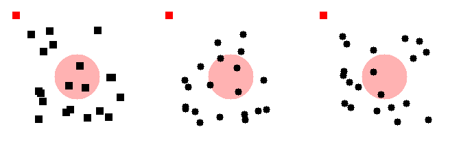

# ELVIS-C

---

## Quick Start

###### Run a quick demo

```
python -m src.main --lite
```


---
## Docker Setup

##### Build the Docker image:

```
git clone https://github.com/akweury/ELVIS-C.git
cd ELVIS-C
docker build -t causal_elvis .
```

##### Run the container:

``` 
docker run -it --gpus all -v /home/your_user_name/ELVIS-C:/app --rm causal_elvis:latest 
```

##### Run the Dataset Generation script:

###### Full Dataset Generation

```
python -m src.main 
``` 

###### Demo Dataset Generation

```
python -m src.main --lite
```


---
## File Structure
All the generated patterns are stored in the `src/video_tasks`
Folloing different gestalt principles, the dataset is splitted into five main tasks:
- **proximity**: Objects that are close together are perceived as a group.
- **similarity**: Objects that are similar in appearance are perceived as a group.
- **closure**: Incomplete shapes are perceived as complete.
- **symmetry**: Symmetrical objects are perceived as a group.
- **continuity**: Objects that follow a continuous path are perceived as a group.

In each principle, there are two main subfolders: `train` and `test`.
Each subfolder contains multiple tasks, which are further divided into `positive` and `negative` examples.
For each task, there are multiple examples for both training and testing. 

Each example is stored in a separate folder named with a unique identifier (e.g., `00001`), 
it contains 20 frames named `frame_000.png`, `frame_001.png`, ..., `frame_019.png`. 

The following is the structure of the dataset:
``` 
src/
│── video_tasks/
│   │── proximity/
│   │   │── train/
│   │   │   │── 0001_task/
│   │   │   │   │── positive/
│   │   │   │   │   │── 00000/
│   │   │   │   │   │   │── frame_000.png
│   │   │   │   │   │   │── frame_001.png
│   │   │   │   │   │   │   ...
│   │   │   │   │   │   │── frame_019.png
│   │   │   │   │   │── 00001/
│   │   │   │   │   │   │── frame_000.png
│   │   │   │   │   │   │   ...
│   │   │   │   │   │   │── frame_019.png
│   │   │   │   │   │   ...
│   │   │   │   │   │── 0000N/
│   │   │   │   │   │   │── frame_000.png
│   │   │   │   │   │   │   ...
│   │   │   │   │   │   │── frame_019.png
│   │   │   │   │── negative/
│   │   │   │   │   │── 00000/
│   │   │   │   │   │   │── frame_000.png
│   │   │   │   │   │   │   ...
│   │   │   │   │   │   │── frame_019.png
│   │   │   │   │   │   ...
│   │   │   │── test/
│   │   │   │   │── ...
│   │   │── similarity/
│   │   │   │── train/
│   │   │   │── test/
│   │   │── closure/
│   │   │   │── train/
│   │   │   │── test/
│   │   │── symmetry/
│   │   │   │── train/
│   │   │   │── test/
│   │   │── continuity/
│   │   │   │── train/
│   │   │   │── test/

```